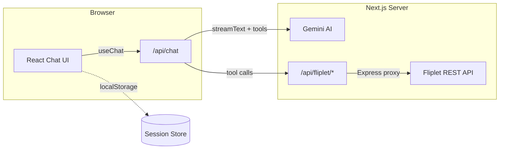

# Fliplet Data Chat

An AI-powered chatbot for querying [Fliplet](https://fliplet.com) data sources. Built with Next.js, Google Gemini, and the Vercel AI SDK.

Users can ask natural language questions about their Fliplet data sources — the AI agent uses tool calls to list, inspect, and query data sources via a secure proxy API, then presents the results conversationally.

## Architecture



**Key components:**

| Layer | File | Description |
|-------|------|-------------|
| UI | `app/page.tsx` | Multi-session chat with sidebar, launch state, animations |
| Chat API | `app/api/chat/route.ts` | Gemini streaming endpoint with Fliplet tool definitions |
| Proxy bridge | `app/api/[...path]/route.ts` | Adapts Next.js Route Handlers to Express |
| Proxy | `lib/express-app.ts` | Express app forwarding requests to Fliplet API |
| Sessions | `lib/sessions.ts` | localStorage CRUD for chat history |
| Styles | `app/globals.css` | All CSS with Fliplet branding and responsive layout |

## Features

- Conversational queries against Fliplet data sources via AI tool use
- Multi-session chat with localStorage persistence
- Sidebar for session navigation and management
- Fliplet branding (logo, colours, Poppins font)
- Responsive layout (desktop sidebar, mobile slide-out)
- Animated transitions with framer-motion
- Streaming responses from Gemini

## Getting Started

### Prerequisites

- Node.js 20+
- A [Fliplet API key](https://developers.fliplet.com/REST-API-Documentation.html)
- A [Google Gemini API key](https://ai.google.dev/)

### Installation

```bash
git clone <repo-url>
cd fliplet-test
npm install
```

### Environment Variables

Create `.env.local` in the project root:

```
FLIPLET_API_KEY=your_fliplet_api_key
FLIPLET_ORG_ID=your_fliplet_org_id
FLIPLET_APP_ID=your_fliplet_app_id
GOOGLE_GENERATIVE_AI_API_KEY=your_gemini_api_key
```

### Development

```bash
npm run dev
```

Open [http://localhost:3000](http://localhost:3000).

### Production Build

```bash
npm run build
npm start
```

### Linting

```bash
npm exec -- ultracite check   # check for issues
npm exec -- ultracite fix     # auto-fix
```

## Deployment

Deploys to [Vercel](https://vercel.com) — set the two environment variables in the Vercel dashboard and push.

## Tech Stack

- **Framework**: Next.js 16 (App Router, Turbopack)
- **AI**: Vercel AI SDK v6, Google Gemini (`gemini-2.5-flash`)
- **Proxy**: Express 5 (mounted inside Next.js API routes)
- **UI**: React 19, framer-motion, plain CSS
- **Linting**: Biome via Ultracite
